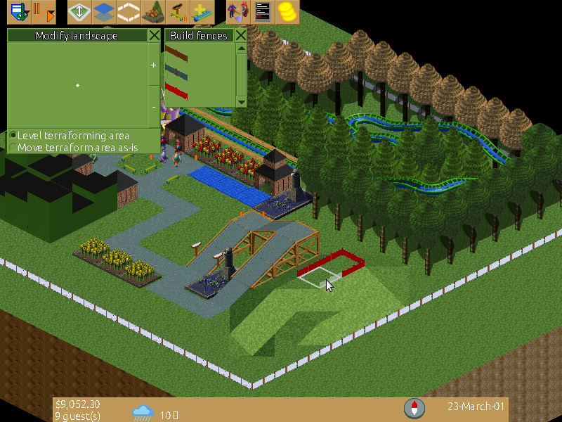

FreeRCT aims to be a free and open source game which captures the look, feel and gameplay of the popular games RollerCoaster Tycoon 1 and 2.

Building the program
--------------------

Currently only Linux is officially supported, although Windows *should* work. Let us know if it's broken.

Almost everything is written in C++, which means you need *g++* or *clang++* to compile it. FreeRCT uses C++11 features, so g++ 4.8+ or clang 3.3+ is recommended.
In addition, you need:

* *lex/flex* - Scanner generator for generating RCD input files. (optional)
* *yacc/bison* - Parser generator for generating RCD input files. (optional)
* *libpng* - Making the RCD data files that contain the graphics and other data read by the program.
* *SDL2* & *SDL2-ttf* - Displaying graphics of the program. Note that SDL2 versions of both libraries are needed.
* *CMake* & *make* - Building the program.

The existence of these programs/libraries is checked by ``cmake``.

Building is as simple as

.. code-block:: bash

        $ git clone https://github.com/FreeRCT/FreeRCT.git
        $ cd FreeRCT # Go into the downloaded source directory.
        $ cmake .    # Checks libraries are where they're supposed to be and replaces some strings
        $ make       # Let make do the heavy work.

CMake accepts the following options:

================= ======= ==========================================================================
Name              Default Explanation
================= ======= ==========================================================================
OVERRIDE_VCS      OFF     Override the lack of a VCS checkout.
ASAN              OFF     Use AddressSanitizer (https://clang.llvm.org/docs/AddressSanitizer.html).
USERDATA_PREFIX   '.'     Directory where user data such as savegames is stored.
================= ======= ==========================================================================

-  **src** directory contains the source code of the FreeRCT program itself.
-  **src/rcdgen** directory contains the source code of the *rcdgen* program, that builds RCD files from source (which are read by *freerct*).
- **graphics/rcd** directory contains the source files of the RCD data files, except the graphics.
- **graphics/sprites** directory contains all the graphics of the game.
- **bin** directory contains the actual *freerct* executable along with some other files required to actually run the program.
- **data** directory contains miscellaneous assets loaded by FreeRCT at runtime.
- **utils** directory contains miscellaneous utility programs and scripts that may make developers' lives easier.

The *cmake/make* commands above will generate the *rcdgen* program, the rcd files and build the 'freerct' program in the src directory.

Config file
-----------

Finally, you can optionally create a 'freerct.cfg' INI format file next to the 'freerct' program in the **bin** directory, containing the settings to use. All entries are optional. It looks like

.. code-block:: ini

        [font]
        medium-size = 12
        medium-path = /usr/share/fonts/gnu-free/FreeSans.ttf

        [language]
        language = nds_DE

        [saveloading]
        auto-resave = false

This means the medium sized font is 12 points high, and its source font definition file is at the indicated path. Make sure you use a path that actually exists. The language is set to Low German by this example, and automatic resaving of savegame files is disabled.

The actual font file is not that critical, as long as it contains the ASCII characters, in the font-size you mention in the file.

All supported options are:

================= ================= ==================================== ==========================================================================
Section           Name              Default value                        Explanation
================= ================= ==================================== ==========================================================================
font              medium-path       <installdir>/data/font/Ubuntu-L.tff  Default font file.
font              medium-size       15                                   Default font size.
language          language          system language                      The language to use. Use ``--help`` for a list of supported languages.
saveloading       auto-resave       false                                If ``true``, automatically resave all savegames directly after loading.
================= ================= ==================================== ==========================================================================

Running the program
-------------------

Now run the program

.. code-block:: bash

        $ cd bin
        $ ./freerct

or

.. code-block:: bash

        $ make run

which should open a window containing the main menu (see also the pictures in the blog).

Pressing 'q' quits the program.

Building Troubleshoot
---------------------
Linux
#####
All the CMake dependencies can be installed under Debian based systems(e.g. Ubuntu) using the following command:

.. code-block:: bash

        $ sudo apt install zlib1g-dev libpng-dev libsdl2-dev libsdl2-ttf-dev doxygen flex bison
